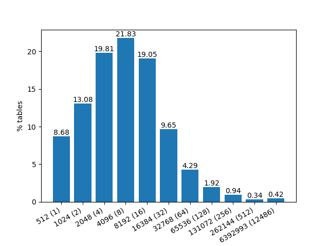
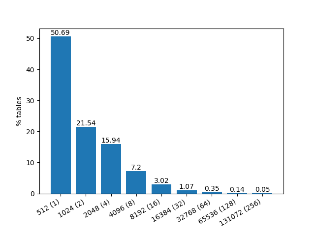

# ToTTo Table linearization
## ToTTo Leaderboard models
### CoNT: Contrastive Neural Text Generation [(An et al., 2022)](https://github.com/Shark-NLP/CoNT)
* **Truncation:** True
* **Input:** Highlighted cells
```json
"<page_title> Brian Ebersole </page_title> <section_title> Mixed martial arts record </section_title> <table> <cell> Chris Lytle <col_header> Opponent </col_header> </cell> <cell> UFC 127 <col_header> Event </col_header> </cell> </table>"
```

### LATTICE: Robust (Controlled) Table-to-Text Generation with Structure-Aware Equivariance Learning [(Wang et al., 2021)](https://aclanthology.org/2022.naacl-main.371/)
* **Truncation:** True
* **Input:** Highlighted cells
```json
"<page_title> Alma Jodorowsky </page_title> <section_title> Filmography </section_title> <table> <cell> 2016 <header> Year </header> </cell> <cell> Evelyn <header> Role </header> </cell> <cell> Kids in Love <header> Title </header> </cell> </table>"
```

### Text-to-Text Pre-Training for Data-to-Text Tasks [(Kale et al., 2021)](https://arxiv.org/pdf/2005.10433.pdf)
* **Truncation:** ??? they don't say
* **Input:** Highlighted cells (said by [(Su et al., 2021)](https://arxiv.org/abs/2108.13740))
"The input is a set of cells from a table, along with metadata such as the title of the table."
No code is provided. No details on the input. I can only speculate saying that they use the highlighted cells as well. And given this is a google research paper, they may also have used the same pre-processing as CoNT and Lattice (as both use the preprocessing code of [google research repo](https://github.com/google-research/language/tree/38e16ec22e7389ed280dd9edf0c4a0c97219a1cf/language/totto/baseline_preprocessing))

### Is Reinforcement Learning (Not) for Natural Language Processing: Benchmarks, Baselines, and Building Blocks for Natural Language Policy Optimization [(Ramamurthy et al. 2022)](https://arxiv.org/abs/2210.01241)
They linearize using the same preprocessing code of the [google research repo](https://github.com/google-research/language/tree/38e16ec22e7389ed280dd9edf0c4a0c97219a1cf/language/totto/baseline_preprocessing) like the previously mentioned works. They concat <table><page_title><section_title><table> Although I don't know why the table is added twice.
* **Truncation:** ??? (but considering they're using vanilla T5 I'd say yes)
* **Input:** Highlighted cells
```json
"<table> <cell> Philip IV the Fair, the Iron King (Philippe) <col_header> Name </col_header> </cell> <cell> 5 October 1285 <col_header> King from </col_header> </cell> <cell> King of France and of Navarre (Roi de France et de Navarre) <col_header> Title </col_header> </cell> </table><page_title> List of French monarchs </page_title> <section_title> House of Capet (987â ̆A ̧S1328) </section_title> <table> <cell> Philip IV the Fair, the Iron King (Philippe) <col_header> Name </col_header> </cell> <cell> 5 October 1285 <col_header> King from </col_header> </cell> <cell> King of France and of Navarre ( Roi de France et de Navarre) <col_header> Title </col_header> </cell> </table>"
```

### Plan-then-Generate: Controlled Data-to-Text Generation via Planning [(Su et al., 2021)](https://arxiv.org/abs/2108.13740)
* **Truncation:** True
* **Input:** Highlighted cells

Logically is this way:
```json
"Page_Title[List of Governors of South Carolina] Section_Title[Governors under the Constitution of 1868] Time[4:03.63] #[76] Governor[Daniel Henry Chamberlain] Took_Office[December 1 , 1874]"
```

But technically, as shown in [their repo](https://github.com/yxuansu/PlanGen/blob/main/data/data_processing_funcs.py), the actual linearization looks like this:
```json
"__page_title__ : List of Governors of South Carolina __EOS____section_title__ : Governors under the Constitution of 1868 __EOS____#__ : 76 __EOS____Governor__ : Daniel Henry Chamberlain __EOS____Took_Office__ : December 1 , 1874 __EOS__"
```

## Linearization efficiency
I have used the different linearization techniques we have at hand to linearize the table and compare how many subword tokens would be requires to encode the linearized representation for `bert-base-uncased`.

### Baseline linearization
This is the out-of-the-box linearization provided the ToTTo oficial code found in the [google research repo](https://github.com/google-research/language/tree/38e16ec22e7389ed280dd9edf0c4a0c97219a1cf/language/totto/baseline_preprocessing). This is the most utilized linearization technique in the leaderboard. Is **very inefficient** but it contains all the information provided for each table without changing anything and without giving any problems.


Many of these tokens belong to pre-defined xml tags (6 opening tags and 6 closing tags). If we define these tags as special tokens for the tokenizer (train has 120k samples, I won't be hard for the model to learn a good embedding representation), the number of tokens per table reduces significantly.


### Table2Logic linearization
This is a custom tokenization method that I developed following a similar approach to [(Chen et al., 2020)](https://www.aclweb.org/anthology/2020.findings-emnlp.190/) to linearize ToTTo tables. As LF execution requires tables to be representable as a strict nxm DataFrame, tables were first converted to pandas DataFrames and then linearized. The resulting table would look like this:
```json
"<columns>col1SEPcol2</columns><table>row 0:cell00;cell01SEProw 1:cell10;cell11</table>"
```
The safest way of doing this was by using the out-of-the-box HTML conversion of tables featured in the [official google research repo](https://github.com/google-research/language/tree/38e16ec22e7389ed280dd9edf0c4a0c97219a1cf/language/totto/baseline_preprocessing). And then, use the built-in pandas function to convert a HTML to DataFrame. 

Using this linearization results in the following token length distribution:


The main downside of this linearization process is that it changes the data structure. Through the constraining process of forcing tables into a DataFrame representation (totto -\> html -\> dataframe), data is rearranged and changed:
* Columns in tables with multiple column rows are merged into one.
* Tables composed by multiple tables are merged into one.

### Triplet linearization
[(Nan et al., 2021)](https://aclanthology.org/2021.naacl-main.37/) demonstrated in their DART dataset that a sequence of triplet representations (column name, row name, value) for each cell is effective in representing tabular data. While prior work (e.g. [Wiseman et al., 2017](https://doi.org/10.18653/v1/D17-1239)) used a similar representation, DART was the first larger study on how to represent tables. Source: TaTTa [(Gehrmann et al ., 2022)](https://arxiv.org/abs/2211.00142).

## Impact of truncation: Where are highlighted cells located
In order to measure the impact of truncating tables, we can use highlighted cells to see how many tables will be affected by truncating from the bottom up. If highlighted cells are located after the truncation point, critical  information needed to produce the gold sentence will be erased. 

Here is the distribution for the index of the last highlighted token in the tokenized linearization of each table using `Table2Logic linearization`.


## ToTTo simplified
Instead of lookin for another dataset. An interesting proposition would be to use heuristics to filter out complex and irregular tables. This would result in a subset of 56.5% samples over the original dataset.
Filtering criteria:
1. Columns must be unique and not ''
2. First row must contain at least one cell marked as header
3. First row must be the row with the most columns
4. It must not have a cell that covers all columns (which its usually considered as a new header)
5. It must pass the span check (which enables it to be converted to pandas DataFrame)

Results (for train set):
1. 113279/120761 93.8% (-6.2%)
2. 106025/120761 87.8% (-6.0%)
3. 76514/120761 63.4% (-24.4%)
4. 69533/120761 57.6% (-5.8%)
5. 68209/120761 56.5% (-1.1%)

Surprisingly, **this does not reduce the average size of tables**. On the contrary, larger tables seem to meet this criteria better.




I believe that this simplification of ToTTo will only help the language baseline (as it was originally designed for). The complexity of tables was the motivation behind the multi-modal approach. 